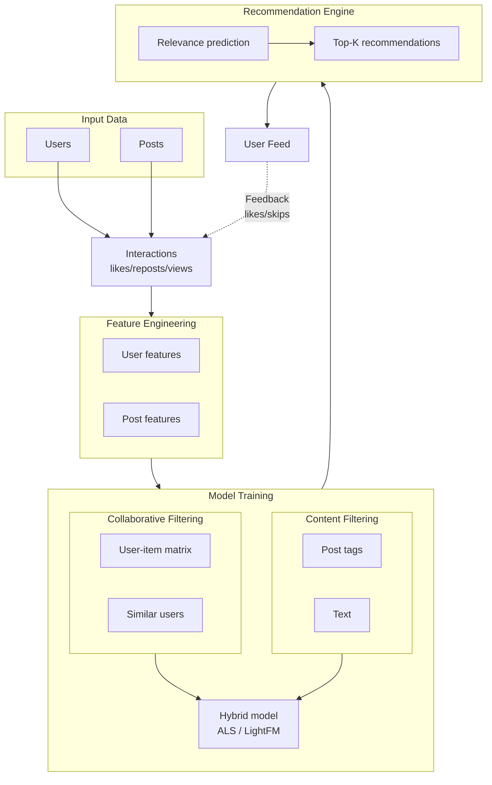

# RecSystem_ML

A recommendation system for a post feed based on user behavior: likes, shares, viewing time, and subscriptions.

## Project goal
To build a personalized recommendation feed.

## Team
| Role | Name | GitHub | Telegram |
|------|-----|--------|----------|
| **Team Lead** | Виктория Жиляева | @viktoria_zhilyaeva | @viktoria_zhilyaeva |
| **ML Engineer** | Милана | @imyourmilla | @imyourmilla |
| **Data Engineer** | Оля | @oladyia | @oladyia |
| **Documentation/Tests** | Катя | @litlsun | @litlsun |

## Planned system architecture



# Pipline: 
Raw Data → Preprocessing → Engineering → Model → Ranking → Feed

## Repo structure: 

```bash
project/
├── data/
│   ├── raw/
│   │   ├── users.csv
│   │   ├── posts.csv
│   │   └── interactions.csv
│   └── processed/
│
├── src/
│   ├── data/
│   │   └── load_data.py
│   ├── features/
│   │   └── build_features.py
│   └── models/
│       └── recommend.py
│
├── notebooks/
│
├── tests/
│   └── test_data.py
│
├── .gitignore
├── main.py
├── requirements.txt

