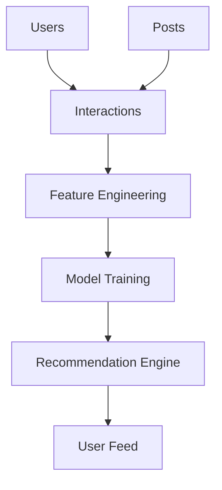

# RecSystem_ML
Repository for the project for ML class: creating recommendation system.

# Planned system architecture: 


# Pipline: 
Raw Data → Preprocessing → Engineering → Model → Ranking → Feed

# Repo structure: 

```bash
project/
├── data/
│   ├── raw/
│   │   ├── users.csv
│   │   ├── posts.csv
│   │   └── interactions.csv
│   └── processed/
│
├── src/
│   ├── data/
│   │   └── load_data.py
│   ├── features/
│   │   └── build_features.py
│   └── models/
│       └── recommend.py
│
├── notebooks/
│
├── tests/
│   └── test_data.py
│
├── .gitignore
├── main.py
├── requirements.txt
└── README.md
```
