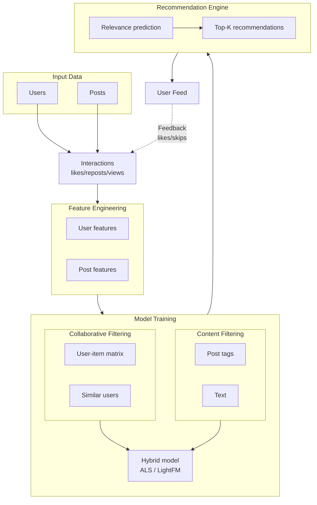

# RecSystem_ML

A recommendation system for a personalized post feed that analyzes user behavior — including likes, shares, viewing time, and subscription — to deliver relevant content through a hybrid model combining collaborative and content filtering.

## Project goal
To build a personalized recommendation feed.

## Team
| Role | Name | GitHub | Telegram |
|------|-----|--------|----------|
| **Team Lead** | Виктория Жиляева | @viktoria_zhilyaeva | @viktoria_zhilyaeva |
| **ML Engineer** | Милана Майорова | @imyourmilla | @imyourmilla |
| **Data Engineer** | Оля Ипатова | @oladyia | @oladyia |
| **Documentation/Tests** | Катя Иванова | @litlsun | @litlsun |

## Planned system architecture



## Pipline
Raw Data → Preprocessing → Engineering → Model → Ranking → Feed

## Repo structure

```bash
project/
├── data/
│   ├── raw/
│   │   ├── users.csv
│   │   ├── posts.csv
│   │   └── interactions.csv
│   └── processed/
│
├── src/
│   ├── data/
│   │   └── load_data.py
│   ├── features/
│   │   └── build_features.py
│   └── models/
│       └── recommend.py
│
├── notebooks/
│
├── tests/
│   └── test_data.py
│
├── .gitignore
├── main.py
├── requirements.txt
```

## Installation

```bash
git clone https://github.com/username/RecSystem_ML
cd RecSystem_ML
pip install -r requirements.txt
```

## Run
```bash
python main.py
```

## Usage Example

### Getting recommendations for a user
```python
import requests

# Get top-10 posts for user_id=42
response = requests.get("http://localhost:8000/recommend", params={
    "user_id": 42,
    "k": 10
})

feed = response.json()
for item in feed["recommendations"]:
    print(f"Post {item['post_id']} | score: {item['score']:.4f}")
```

### Example of API response:
```json
{
  "user_id": 42,
  "recommendations": [
    {"post_id": 101, "score": 0.92},
    {"post_id": 205, "score": 0.87},
    {"post_id": 307, "score": 0.85}
  ],
  "timestamp": "2026-04-14T12:00:00Z"
}
```
