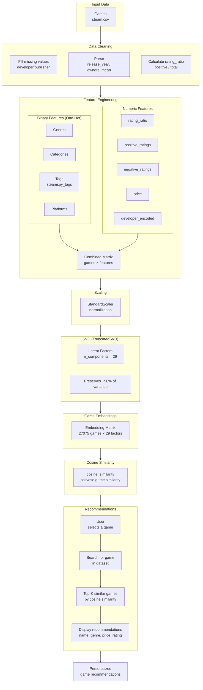

# RecSystem_ML

A recommendation system for the Steam gaming platform, built on a Content-Based approach using SVD decomposition. The system operates on the item-to-item principle: when a user views a specific game, the system recommends other games that are most similar in terms of their feature set.

## Project goal
To develop a recommendation system that, based on game features (genres, categories, tags, platforms, etc.), generates personalized recommendations, helping users find games that match their preferences.

## Team
| Role | Name | GitHub | Telegram |
|------|-----|--------|----------|
| **Team Lead** | Виктория Жиляева | @zhilyaevaviktorija | @viktoria_zhilyaeva |
| **Data Engineer** | Милана Майорова | @svyatoslavna | @imyourmilla |
| **ML Engineer** | Оля Ипатова | @oladiya | @oladyia |
| **Documentation/Tests** | Катя Иванова | @litlsun | @litlsun |

## System architecture


```mermaid
flowchart TD
    subgraph INPUT["Input Data"]
        GAMES[Games<br/>steam.csv]
    end

    GAMES --> CLEANING

    subgraph CLEANING["Data Cleaning"]
        direction TB
        FILL[Fill missing values<br/>developer/publisher]
        PARSE[Parse<br/>release_year, owners_mean]
        RATING[Calculate rating_ratio<br/>positive / total]
    end

    CLEANING --> FEATURES

    subgraph FEATURES["Feature Engineering"]
        direction TB
        
        subgraph BINARY["Binary Features (One-Hot)"]
            GENRES[Genres]
            CATEGORIES[Categories]
            TAGS[Tags<br/>steamspy_tags]
            PLATFORMS[Platforms]
        end

        subgraph NUMERIC["Numeric Features"]
            RATING_RATIO[rating_ratio]
            POSITIVE[positive_ratings]
            NEGATIVE[negative_ratings]
            PRICE[price]
            DEVELOPER[developer_encoded]
        end

        BINARY --> COMBINE
        NUMERIC --> COMBINE
        COMBINE[Combined Matrix<br/>games × features]
    end

    FEATURES --> SCALING

    subgraph SCALING["Scaling"]
        STANDARD[StandardScaler<br/>normalization]
    end

    SCALING --> SVD

    subgraph SVD["SVD (TruncatedSVD)"]
        LATENT[Latent Factors<br/>n_components = 29]
        VARIANCE[Preserves ~90% of variance]
    end

    SVD --> EMBEDDINGS

    subgraph EMBEDDINGS["Game Embeddings"]
        MATRIX[Embedding Matrix<br/>27075 games × 29 factors]
    end

    EMBEDDINGS --> SIMILARITY

    subgraph SIMILARITY["Cosine Similarity"]
        COSINE[cosine_similarity<br/>pairwise game similarity]
    end

    SIMILARITY --> RECOMMEND

    subgraph RECOMMEND["Recommendations"]
        direction TB
        USER_INPUT[User<br/>selects a game]
        SEARCH[Search for game<br/>in dataset]
        TOP[Top-K similar games<br/>by cosine similarity]
        OUTPUT[Display recommendations<br/>name, genre, price, rating]
        
        USER_INPUT --> SEARCH --> TOP --> OUTPUT
    end

    RECOMMEND --> RESULT

    RESULT[Personalized<br/>game recommendations]
```

## Pipline
Raw Data → Preprocessing → Engineering → Model → Ranking → Feed

## Repo structure

project/
├── data_csv/
│   ├── cleaned_data.csv
│   └── raw_steam.csv
│
├── notebooks/
│   ├── eda_steam.ipynb
│   └── recsys_steam.ipynb
│
├── src/
│   ├── data/
│   │   └── load_data.py
│   ├── features/
│   │   └── build_features.py
│   └── models/
│       ├── download_model.py
│       └── recommend.py
│
├── tests/
│   ├── recsys_test.md
│   └── test_evaluation.py
│
├── .gitignore
├── README.md
├── main.py
└── requirements.txt

## Installation

```bash
git clone https://github.com/username/RecSystem_ML
cd RecSystem_ML
pip install -r requirements.txt
```

## Run
```bash
python main.py
```

## Usage Example

### Getting recommendations for a user
```python
import requests

# Get top-10 posts for user_id=42
response = requests.get("http://localhost:8000/recommend", params={
    "user_id": 42,
    "k": 10
})

feed = response.json()
for item in feed["recommendations"]:
    print(f"Post {item['post_id']} | score: {item['score']:.4f}")
```

### Example of API response:
```json
{
  "user_id": 42,
  "recommendations": [
    {"post_id": 101, "score": 0.92},
    {"post_id": 205, "score": 0.87},
    {"post_id": 307, "score": 0.85}
  ],
  "timestamp": "2026-04-14T12:00:00Z"
}
```
